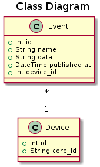

# Particle to Database Adapter

This tool is used to save events and their associated devices of a particle cloud
to a MySQL database.


## Description of the Database

For this program to work you need a MySQL database with two tables:




## Usage: On you machine

Create a .env file with the following variables:

 * DBHOST: name of database host
 * DBUSER: name of the database user
 * DBPASSWORD: password for the user
 * DBDATABASE: name of the database on the host
 * PARTICLE_LOGIN: login on the particle cloud
 * PARTICLE_PASSWORD: password on the particle cloud

Then launch the program with:

```
$ node main.js
```


## Usage: With a docker container

You can either pull the image from Docker Hub:

```
$ docker pull yannickmayeur/particletodatabase
```

Or build it with the help of the Dockerfile.

To run the image pass the environment variables to the container and link a MySQL
container to it with docker-compose for example.


## Dependencies

The project relies on the [Particle API JS](https://docs.particle.io/reference/javascript/).
